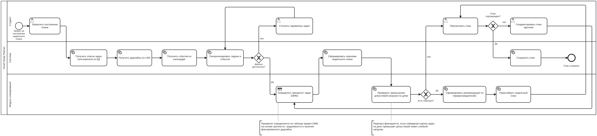

# BPMN и DMN

## BPMN-процесс

BPMN описывает процесс формирования недельного учебного плана. Пользователь инициирует генерацию, система собирает задачи и события, определяет приоритеты, проверяет перегрузку и показывает результат.

BPMN создан в demo.bpmn.io: [https://demo.bpmn.io/new](https://demo.bpmn.io/new)

Ссылка на доску UniDraw: [https://unidraw.io/app/board/3921a3d1d3cd53eed9d9](https://unidraw.io/app/board/3921a3d1d3cd53eed9d9)

## DMN-модель

DMN-модель используется для определения приоритета задачи. На вход подаются срочность, трудоёмкость и наличие фиксированного дедлайна. На выходе система получает приоритет: `high`, `medium` или `low`.

Файл DMN: [task-priority.dmn](task-priority.dmn)

DMN создан в demo.bpmn.io/dmn: [https://demo.bpmn.io/dmn](https://demo.bpmn.io/dmn)

## Основные правила

| Условие | Результат |
| --- | --- |
| Высокая срочность | Высокий приоритет |
| Средняя срочность, большая трудоёмкость, есть дедлайн | Высокий приоритет |
| Средняя срочность и есть дедлайн | Средний приоритет |
| Низкая срочность и есть дедлайн | Средний приоритет |
| Низкая срочность без дедлайна | Низкий приоритет |
| Параметры не заданы | Низкий приоритет |
