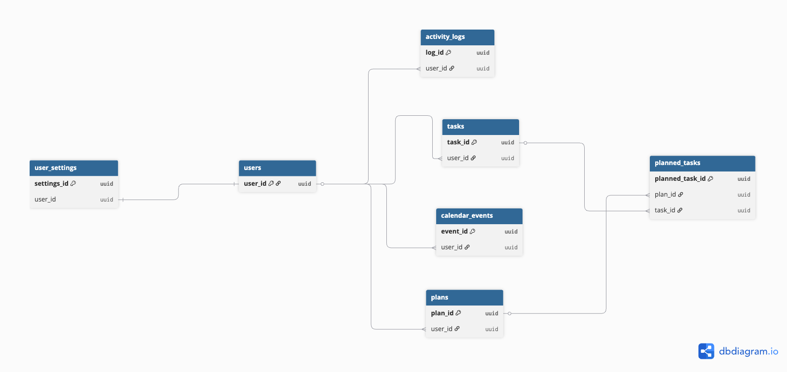
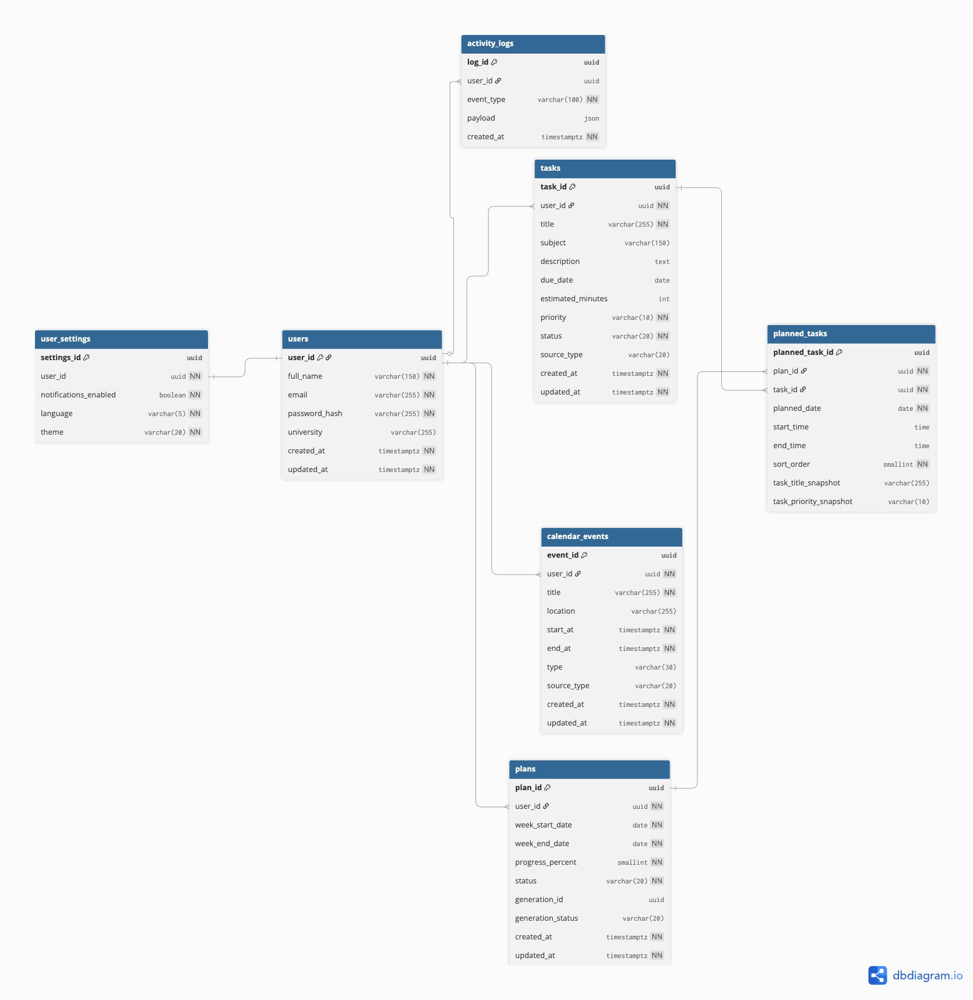

# ERD и модель данных

## Концептуальная модель

Концептуальная модель показывает бизнес-объекты без технических деталей. Пользователь имеет настройки, задачи, календарные события и планы. План включает запланированные задачи. Действия пользователя и системы фиксируются в логах активности.

DBML-файл: [erd-conceptual.dbml](erd-conceptual.dbml)

Ссылка на dbdiagram: [https://dbdiagram.io/d/69ea2bc4d80a958d1cc463b9](https://dbdiagram.io/d/69ea2bc4d80a958d1cc463b9)

## Логическая модель

Логическая модель добавляет атрибуты, первичные и внешние ключи. Настройки пользователя вынесены отдельно. Связь между планом и задачей реализована через `planned_tasks`, потому что она содержит собственные атрибуты: дату выполнения, время начала, время окончания и порядок отображения.

DBML-файл: [erd-logical.dbml](erd-logical.dbml)

Ссылка на dbdiagram: [https://dbdiagram.io/d/Logicheskaya-model-69ea2ca41bbca0331227721d](https://dbdiagram.io/d/Logicheskaya-model-69ea2ca41bbca0331227721d)

## Физическая модель

Физическая модель адаптирована под реляционную базу данных. Используются `uuid`, ограничения `UNIQUE`, `NOT NULL`, индексы и snapshot-поля для сохранения состояния задачи внутри плана.

DBML-файл: [erd-physical.dbml](erd-physical.dbml)

Ссылка на dbdiagram: [https://dbdiagram.io/d/Fizicheskaya-model-69ea2d361bbca03312278376](https://dbdiagram.io/d/Fizicheskaya-model-69ea2d361bbca03312278376)

## Почему убрана PlanDay

После доработки модели отдельная сущность `PlanDay` не используется. Достаточно хранить дату и временные параметры в `planned_tasks`, потому что пользователь редактирует фактически включение задачи в конкретный день.
