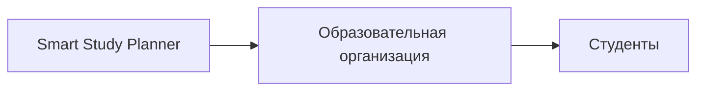

# Интеграции и платформизация

## LMS API

В системе можно заменить ручное получение учебных задач и дедлайнов интеграцией с LMS, например Moodle или Canvas. Пользователь подключает LMS через OAuth или токен, после чего приложение получает список курсов, задания и дедлайны. Эти данные преобразуются в сущности `Task` и `Event` и используются при генерации плана.

## Что даёт интеграция

Интеграция с LMS уменьшает ручной ввод, повышает актуальность данных и делает планирование ближе к реальному учебному процессу. Сервис не заменяет LMS, а выступает надстройкой, которая превращает учебные задания в персональный план.

## Стратегия платформизации

Smart Study Planner можно развивать как платформу для образовательных организаций. Основная ценность платформы — алгоритм планирования и логика распределения задач, а не простое хранение дедлайнов.

## Целевая аудитория платформы

Потенциальные покупатели: университеты, онлайн-школы, EdTech-платформы и корпоративные обучающие центры.

## Бизнес-модель

Модель — B2B2C: платформа продаётся образовательной организации, а конечными пользователями являются студенты.

## Монетизация

Основная модель монетизации — подписка. Возможны два варианта: фиксированная стоимость для организации или оплата за активного пользователя. Такой подход даёт предсказуемую выручку и масштабируется вместе с количеством пользователей.
