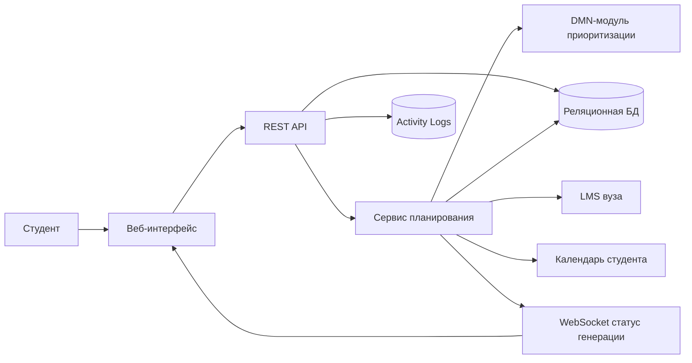

# Архитектура системы

## Контекст

Smart Study Planner состоит из клиентского веб-интерфейса, backend API, сервиса планирования, модуля приоритизации, реляционной базы данных, аналитического контура логов и внешних интеграций с LMS и календарём.

## Основные компоненты

**Веб-интерфейс** отвечает за авторизацию, просмотр задач, календаря, генерацию и редактирование плана.

**REST API** предоставляет ресурсы авторизации, пользователей, задач, календарных событий и планов.

**Сервис планирования** объединяет задачи, дедлайны и календарные события, запускает приоритизацию и формирует недельный план.

**DMN-модуль** реализует правила определения приоритета задачи на основе срочности, трудоёмкости и наличия фиксированного дедлайна.

**Реляционная БД** хранит пользователей, настройки, задачи, события, планы и запланированные задачи.

**Activity logs** используются для аналитики и диагностики.

## Архитектурные решения

Система проектируется как веб-приложение с REST API и асинхронным каналом WebSocket для длительной операции генерации плана. Основные данные хранятся в реляционной БД, так как имеют строгую структуру и связи. Логи активности выделяются отдельно, поскольку относятся к аналитическому контуру.

## Связь с требованиями

Архитектура поддерживает ключевые требования MVP: регистрацию, задачи, календарь, генерацию плана, ручную корректировку и сохранение результата. Полноценные интеграции с LMS и внешним календарём можно развивать постепенно, не меняя базовую модель данных.
