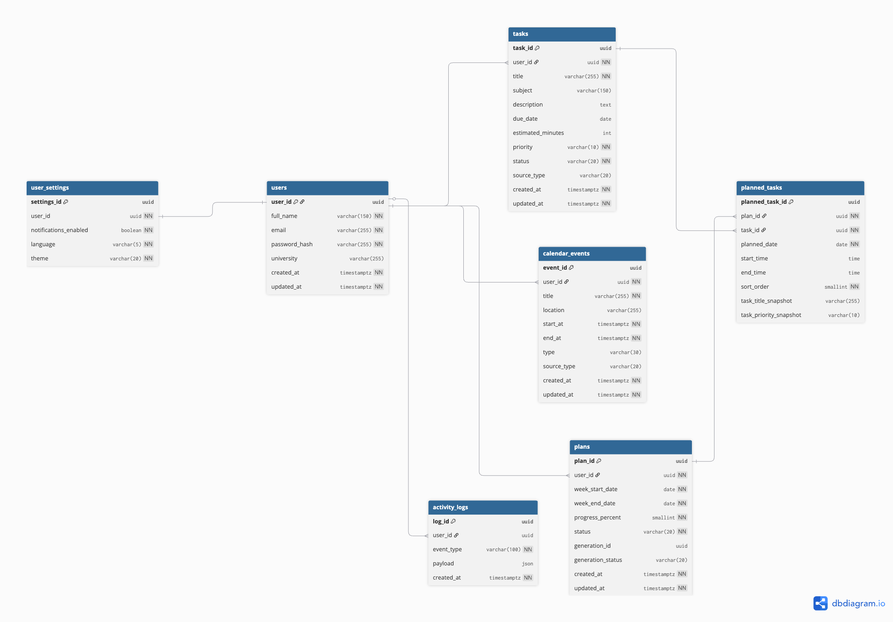

# ERD

В разделе приведены три уровня модели данных: концептуальный, логический и физический. Они фиксируют развитие модели от бизнес-объектов к структуре, пригодной для реализации в реляционной базе данных.

## Концептуальная ERD

DBML-файл: [erd-conceptual.dbml](erd-conceptual.dbml)

Ссылка: [https://dbdiagram.io/d/69ea2bc4d80a958d1cc463b9](https://dbdiagram.io/d/69ea2bc4d80a958d1cc463b9)

## Логическая ERD

DBML-файл: [erd-logical.dbml](erd-logical.dbml)

Ссылка: [https://dbdiagram.io/d/Logicheskaya-model-69ea2ca41bbca0331227721d](https://dbdiagram.io/d/Logicheskaya-model-69ea2ca41bbca0331227721d)

## Физическая ERD

DBML-файл: [erd-physical.dbml](erd-physical.dbml)

Ссылка: [https://dbdiagram.io/d/Fizicheskaya-model-69ea2d361bbca03312278376](https://dbdiagram.io/d/Fizicheskaya-model-69ea2d361bbca03312278376)
