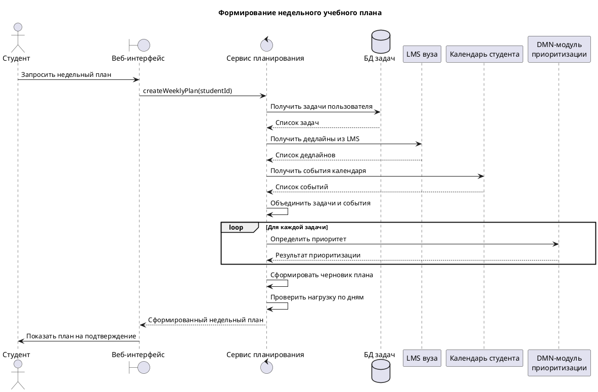

# Sequence и Use Case

## Sequence diagram

Диаграмма последовательности описывает сценарий формирования недельного учебного плана.

PlantUML-файл: [`/static/diagrams/sequence-weekly-plan.puml`](/diagrams/sequence-weekly-plan.puml)

## Use Case diagram

Диаграмма вариантов использования показывает взаимодействие студента, LMS и календаря с системой.

PlantUML-файл: [`/static/diagrams/use-case-weekly-plan.puml`](/diagrams/use-case-weekly-plan.puml)

Ключевой сценарий — «Сформировать недельный план». Он включает импорт дедлайнов из LMS, получение событий календаря, определение приоритета задач и проверку перегруза по дням. Ручная корректировка и сохранение плана расширяют основной сценарий.

## Draw.io

Для выполнения требования по draw.io в проект добавлен файл: [`/static/diagrams/planning-flow.drawio`](/diagrams/planning-flow.drawio). Его можно открыть в diagrams.net или через VS Code-расширение Draw.io Integration.
