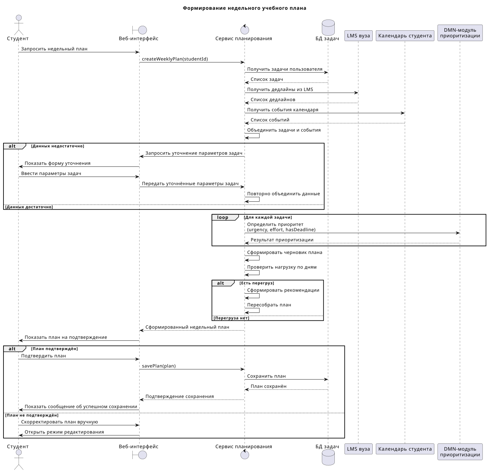

# Sequence diagram

Диаграмма последовательности показывает сценарий формирования недельного учебного плана: запрос пользователя, сбор задач, импорт дедлайнов из LMS, получение календарных событий, приоритизация через DMN, проверка перегруза и сохранение подтверждённого плана.

PlantUML-файл: [sequence.puml](sequence.puml)

Ссылка на доску UniDraw: [https://unidraw.io/app/board/c89cb75281732a592020](https://unidraw.io/app/board/c89cb75281732a592020)
