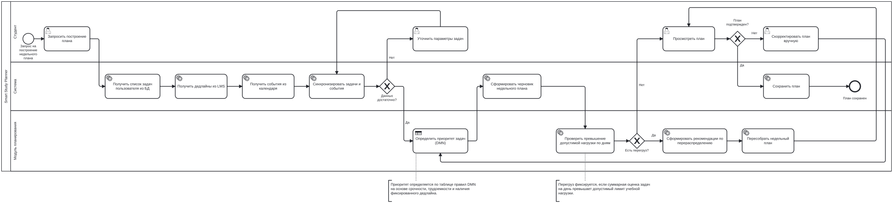

# BPMN и DMN

Раздел содержит процессную модель и таблицу принятия решений для функции формирования недельного учебного плана.

## BPMN

Ссылки:

- [BPMN editor demo.bpmn.io](https://demo.bpmn.io/new)
- [Доска UniDraw с BPMN и DMN](https://unidraw.io/app/board/3921a3d1d3cd53eed9d9)

## DMN

DMN-файл: [task-priority.dmn](task-priority.dmn)

Решение определяет приоритет задачи по трём входным параметрам: срочность, трудоёмкость и наличие фиксированного дедлайна.
