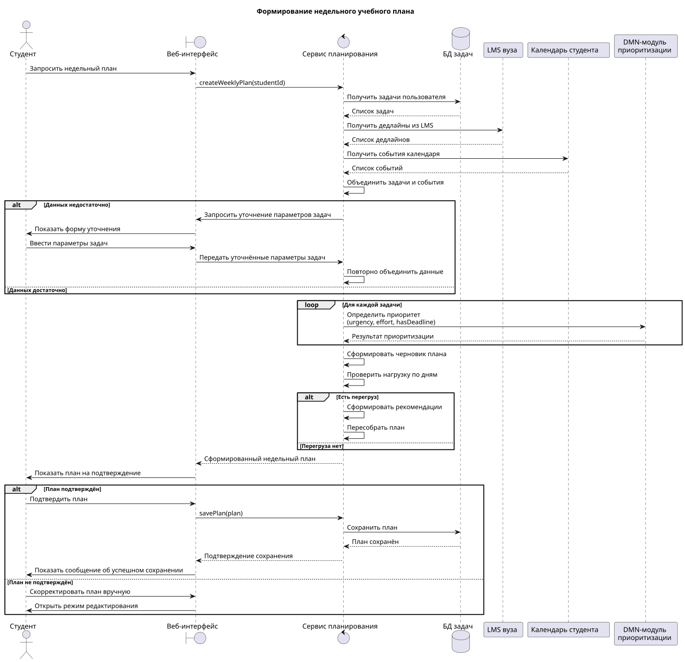
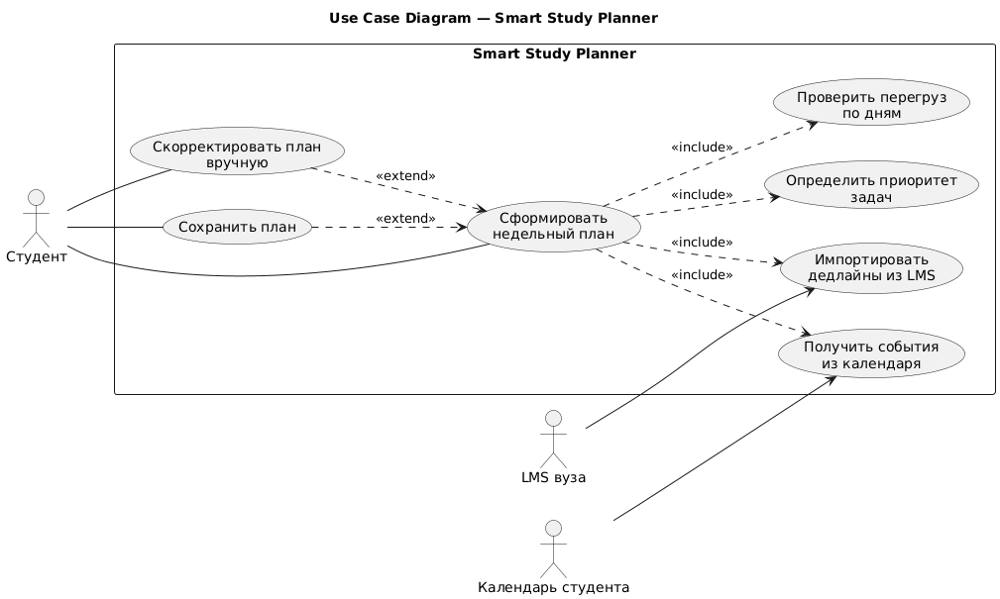

## Sequence diagram

Ссылка на UniDraw: [https://unidraw.io/app/board/c89cb75281732a592020](https://unidraw.io/app/board/c89cb75281732a592020)



Код:

```Plain Text
@startuml
title Формирование недельного учебного плана

actor "Студент" as Student
boundary "Веб-интерфейс" as UI
control "Сервис планирования" as Planner
database "БД задач" as DB
participant "LMS вуза" as LMS
participant "Календарь студента" as Calendar
participant "DMN-модуль\nприоритизации" as DMN

Student -> UI : Запросить недельный план
UI -> Planner : createWeeklyPlan(studentId)

Planner -> DB : Получить задачи пользователя
DB --> Planner : Список задач

Planner -> LMS : Получить дедлайны из LMS
LMS --> Planner : Список дедлайнов

Planner -> Calendar : Получить события календаря
Calendar --> Planner : Список событий

Planner -> Planner : Объединить задачи и события

alt Данных недостаточно
    Planner -> UI : Запросить уточнение параметров задач
    UI -> Student : Показать форму уточнения
    Student -> UI : Ввести параметры задач
    UI -> Planner : Передать уточнённые параметры задач
    Planner -> Planner : Повторно объединить данные
else Данных достаточно
end

loop Для каждой задачи
    Planner -> DMN : Определить приоритет\n(urgency, effort, hasDeadline)
    DMN --> Planner : Результат приоритизации
end

Planner -> Planner : Сформировать черновик плана
Planner -> Planner : Проверить нагрузку по дням

alt Есть перегруз
    Planner -> Planner : Сформировать рекомендации
    Planner -> Planner : Пересобрать план
else Перегруза нет
end

Planner --> UI : Сформированный недельный план
UI -> Student : Показать план на подтверждение

alt План подтверждён
    Student -> UI : Подтвердить план
    UI -> Planner : savePlan(plan)
    Planner -> DB : Сохранить план
    DB --> Planner : План сохранён
    Planner --> UI : Подтверждение сохранения
    UI -> Student : Показать сообщение об успешном сохранении
else План не подтверждён
    Student -> UI : Скорректировать план вручную
    UI -> Student : Открыть режим редактирования
end

@enduml
```

## Use case diagram

Ссылка на UniDraw: [https://unidraw.io/app/board/c89cb75281732a592020](https://unidraw.io/app/board/c89cb75281732a592020)



Код:

```Plain Text
@startuml
left to right direction
title Use Case Diagram — Smart Study Planner

actor "Студент" as Student
actor "LMS вуза" as LMS
actor "Календарь студента" as Calendar

rectangle "Smart Study Planner" {
  usecase "Сформировать\nнедельный план" as UC1
  usecase "Импортировать\nдедлайны из LMS" as UC2
  usecase "Получить события\nиз календаря" as UC3
  usecase "Определить приоритет\nзадач" as UC4
  usecase "Проверить перегруз\nпо дням" as UC5
  usecase "Скорректировать план\nвручную" as UC6
  usecase "Сохранить план" as UC7
}

Student -- UC1
Student -- UC6
Student -- UC7

LMS --> UC2
Calendar --> UC3

UC1 ..> UC2 : <<include>>
UC1 ..> UC3 : <<include>>
UC1 ..> UC4 : <<include>>
UC1 ..> UC5 : <<include>>
UC6 ..> UC1 : <<extend>>
UC7 ..> UC1 : <<extend>>

@enduml
```


